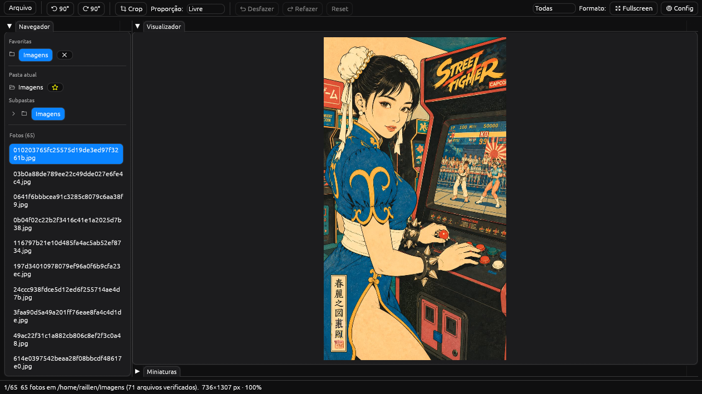

# photoshow

Visualizador de fotos rápido em Rust ([egui](https://github.com/emilk/egui)):
abra pastas ou arquivos soltos, navegue, edite e salve — sem travar,
sem banco de dados, sem nuvem.



## Recursos

- **Abertura rápida** — pastas (varredura assíncrona com progresso) ou
  arquivos soltos; JPG, PNG, WebP, TIFF, BMP, GIF
- **Navegação** — árvore de pastas com expansão lazy, favoritas fixadas,
  lista virtualizada (50k fotos sem engasgo), galeria de miniaturas em
  grade fluida com tamanho ajustável
- **Viewer** — zoom ancorado no cursor, pan, fullscreen, modo maximizado,
  correção automática de orientação EXIF, prefetch de vizinhas
- **Edição não-destrutiva** — rotate 90°, crop por arrasto (mover +
  gizmos, proporção opcional, `Enter` aplica), undo/redo, preview
  instantâneo; Salvar sobrescreve (com confirmação) ou Salvar como…
- **Produtividade** — menu Arquivo único, botão direito (copiar
  caminho/imagem, abrir, mostrar na pasta), renomear (`F2`), atalhos
  de teclado, painéis redimensionáveis em dock, temas claro/escuro,
  qualidade JPEG e prefetch configuráveis

## Atalhos

| Tecla | Ação |
|---|---|
| `←` `→` | foto anterior / próxima |
| `+` `-` `0` | zoom + / − / ajustar |
| `F2` | renomear |
| `Ctrl+Z` / `Ctrl+Y` | desfazer / refazer edição |
| `Enter` | aplicar crop |
| `F9` | maximizar visualizador |
| `F11` | fullscreen (`Esc` sai) |

## Instalação

Via script (Linux x86_64, sem root — baixa a última release):

```bash
curl -fsSL https://raw.githubusercontent.com/raillen/photoshow/main/install.sh | bash
```

Por distribuição (na página de [releases](https://github.com/raillen/photoshow/releases)):

| Sistema | Arquivo |
|---|---|
| Debian/Ubuntu | `photoshow_*_amd64.deb` (`sudo dpkg -i`) |
| Fedora/openSUSE | `photoshow-*.x86_64.rpm` (`sudo rpm -i` / `dnf install`) |
| Arch | `dist/arch/PKGBUILD` ([instruções](./dist/README.md)) |
| Windows | `photoshow-*-x86_64-pc-windows-msvc.zip` (só extrair o `.exe`) |
| Qualquer Linux | tarball + `install.sh` acima |

Do código-fonte (requer Rust 1.95+):

```bash
cargo install --path .
# ou rode direto:
cargo run --release
```

## Configuração

Tudo em `~/.config/photoshow/config.json`: favoritas, última pasta,
tema, qualidade JPEG, prefetch, comportamento da varredura. Editável
pelo menu Config dentro do app.

## Desenvolvimento

```bash
cargo test && cargo fmt --all && cargo clippy --all-targets
```

Veja [CONTRIBUTING.md](./CONTRIBUTING.md) e o [ROADMAP.md](./ROADMAP.md)
(planejado até a 2.0, incluindo editor RAW enxuto via feature flag).

## Licença

MIT — veja [LICENSE-MIT](./LICENSE-MIT).

Apoie: [ko-fi.com/raillen](https://ko-fi.com/raillen)
