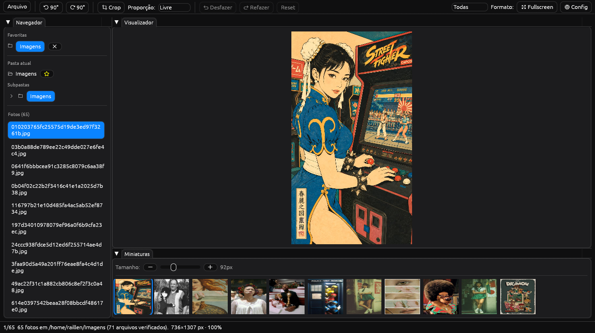
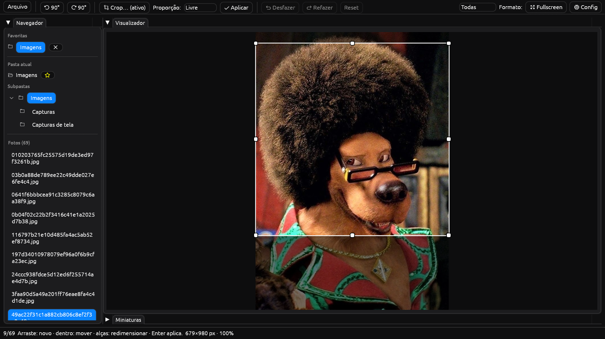

# Guia de uso — photoshow

Documentação prática da interface. Evolui junto com o app: cada
ferramenta nova ganha sua seção aqui (veja o [ROADMAP](../../ROADMAP.md)).

- [Painéis](#painéis)
- [Ferramenta de crop](#ferramenta-de-crop)

---

## Painéis

A janela é dividida em três painéis redimensionáveis (arraste as bordas
ou reorganize as abas; o menu **Arquivo → Restaurar layout** volta ao padrão):

| Painel | O que faz |
|---|---|
| **Navegador** (esquerda) | **Favoritas**: pastas fixadas (★) para acesso imediato. **Pasta atual** com a árvore de subpastas (expansão sob demanda). **Fotos**: lista virtualizada — rola liso mesmo com 50 mil arquivos |
| **Visualizador** (centro) | Foto atual com zoom (scroll, ancorado no cursor), pan por arrasto, duplo-clique reseta. `F11` fullscreen, `F9` maximiza só o viewer |
| **Miniaturas** (embaixo) | Galeria em grade que se adapta à largura do painel. Slider `− / ＋` ajusta o tamanho (48–192px, salvo nas preferências). Borda azul = foto selecionada. **Duplo-clique** maximiza o Visualizador |

Barra superior única: menu **Arquivo** (abrir pasta/arquivos, salvar,
salvar como, renomear) + ferramentas de edição + filtro de formato,
fullscreen e Config à direita. A barra de status embaixo mostra
`posição/total`, pasta, dimensões e zoom.

## Ferramenta de crop

1. Clique em **Crop** na barra superior (a área fora da foto escurece)
2. **Arraste** sobre a foto para criar a seleção
3. **Arraste de dentro** para mover; use as **alças brancas** das bordas
   e cantos para redimensionar com precisão
4. Opcional: trave a proporção no dropdown (`Livre`, `1:1`, `4:3`,
   `3:2`, `16:9`, `9:16`) — a seleção obedece ao arrasto e ao redimensionar
5. Confirme com **Enter** ou **✔ Aplicar** (`Esc` cancela sem aplicar)

O crop entra na pilha de edição não-destrutiva: aparece o aviso
`• editado`, e vale `Desfazer` (`Ctrl+Z`) / `Refazer` (`Ctrl+Y`).
Nada é gravado até **Arquivo → Salvar** (sobrescreve com confirmação)
ou **Salvar como…**. Rotacionar com crop ativo move o recorte junto.
